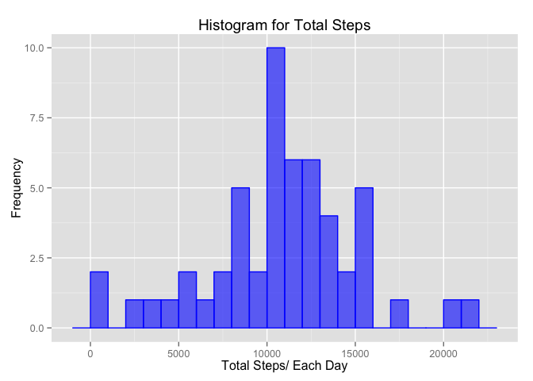
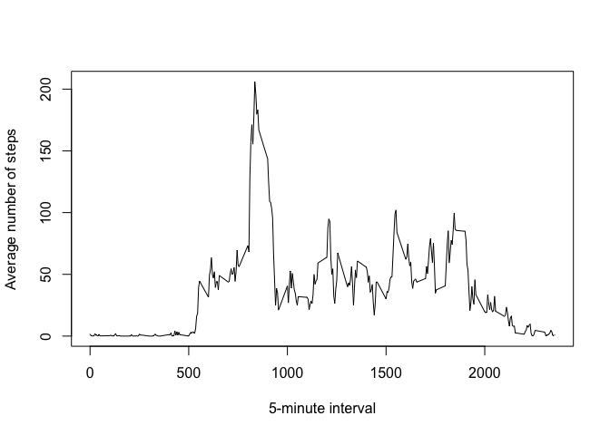
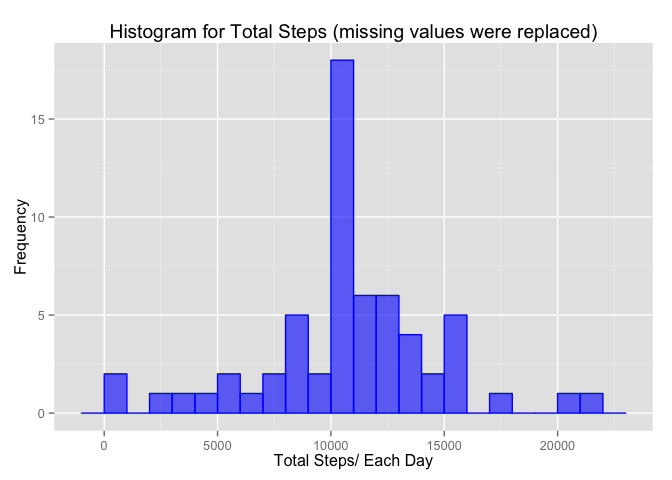
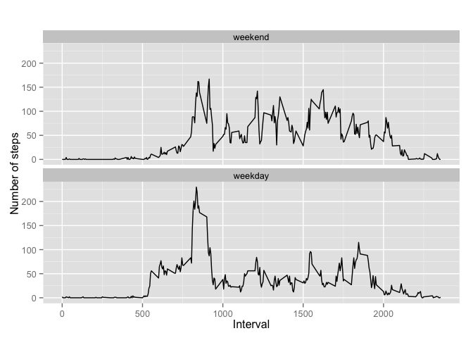

# Reproducible Research: Peer Assessment 1
Maria Presnukhina  
  
    
    
Loading dependencies:

```r
library(lubridate)
library(dplyr)
```

```
## 
## Attaching package: 'dplyr'
## 
## The following objects are masked from 'package:lubridate':
## 
##     intersect, setdiff, union
## 
## The following object is masked from 'package:stats':
## 
##     filter
## 
## The following objects are masked from 'package:base':
## 
##     intersect, setdiff, setequal, union
```

```r
library(ggplot2)
```

## Loading and preprocessing the data

```r
activity <- read.csv("activity.csv", header  = TRUE, na.strings = "NA" )
## transforming dates to POSIX object
activity$date <- ymd(activity$date)
```

## What is mean total number of steps taken per day?  
  
Calculating the total number of steps taken per day:

```r
steps_summary <- activity %>%
        na.omit()%>%
        group_by(date)%>%
        summarise(total = sum(steps, na.rm  = TRUE))
```
   
Plotting a histogram of the total number of steps taken each day:

```r
ggplot(data=steps_summary, aes(steps_summary$total)) + 
        geom_histogram(binwidth = 1000,
                col="blue", 
                fill = "blue",
                alpha = .6) + 
        labs(title="Histogram for Total Steps") +
        labs(x="Total Steps/ Each Day", y="Frequency") 
```



Calculating and reporting the mean and median of the total number of steps taken per day:  

```r
mean(steps_summary$total)
```

```
## [1] 10766.19
```

```r
median(steps_summary$total)
```

```
## [1] 10765
```
  
## What is the average daily activity pattern?

Making a time series plot of the 5-minute interval (x-axis) and the average number of steps taken, averaged across all days (y-axis):

```r
steps_int_avg<- activity %>%
        na.omit()%>%
        group_by(interval)%>%
        summarise(steps = mean(steps, na.rm  = TRUE))

plot(steps_int_avg, type = "l", xlab = "5-minute interval",  ylab = "Average number of steps")
```



Answering the following question:
"Which 5-minute interval, on average across all the days in the dataset, contains the maximum number of steps?"

```r
round(filter(steps_int_avg, interval, steps == max(steps)))
```

```
## Source: local data frame [1 x 2]
## 
##   interval steps
## 1      835   206
```

## Imputing missing values
Calculating and reporting the total number of missing values in the dataset:

```r
missing_values<- activity %>%
        count(missing = is.na(steps)) %>%
        filter(missing == TRUE)

missing_values$n
```

```
## [1] 2304
```

Creating a new dataset that is equal to the original dataset but with the missing data filled in. (Using the mean for needed 5-minutes interval):

```r
activity_noNA <- activity

for (i in 1:nrow(activity_noNA)) {
        if (is.na(activity_noNA$steps[i])) {
                steps_int <- filter(steps_int_avg, interval == activity_noNA$interval[i])
                activity_noNA$steps[i] <- steps_int$steps
        }
}
```
Making a histogram of the total number of steps taken each day: 

```r
steps_summary_noNA <- activity_noNA %>%
        group_by(date)%>%
        summarise(total = sum(steps, na.rm  = TRUE))

ggplot(data=steps_summary_noNA, aes(steps_summary_noNA$total)) + 
        geom_histogram(binwidth = 1000,
                       col="blue", 
                       fill = "blue",
                       alpha = .6) + 
        labs(title="Histogram for Total Steps (missing values were replaced)") +
        labs(x="Total Steps/ Each Day", y="Frequency") 
```



Calculating and reporting the mean and median total number of steps taken per day:

```r
mean(steps_summary_noNA$total)
```

```
## [1] 10766.19
```

```r
median(steps_summary_noNA$total)
```

```
## [1] 10766.19
```
**Imputing missing values removes a bias from median calculation. **
   
   
## Are there differences in activity patterns between weekdays and weekends?
Creating a new factor variable in the dataset with two levels – “weekday” and “weekend” indicating whether a given date is a weekday or weekend day:

```r
activity_noNA <- mutate(activity_noNA,weekday = factor((weekdays(activity_noNA$date) %in% c("Monday","Tuesday","Wednesday","Thursday","Friday")), 
                   levels=c(FALSE, TRUE), labels=c('weekend', 'weekday'))) 
```
Making a panel plot containing a time series plot of the 5-minute interval (x-axis) and the average number of steps taken, averaged across all weekday days or weekend days (y-axis):

```r
steps_int_avg_w<- activity_noNA %>%
        group_by(interval,weekday)%>%
        summarise(steps = round(mean(steps,na.rm  = TRUE)))

qplot(data=steps_int_avg_w, x = interval, y = steps, geom=c("line"), xlab="Interval", 
      ylab="Number of steps", main="") + facet_wrap(~ weekday, ncol=1)
```

 
